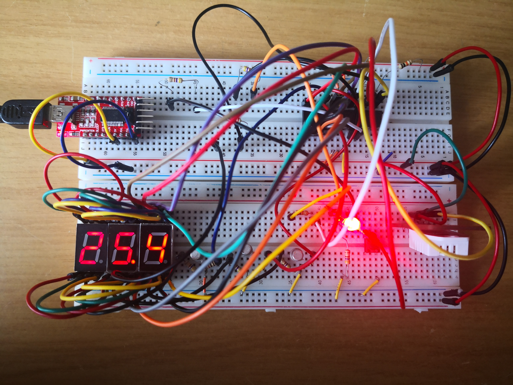
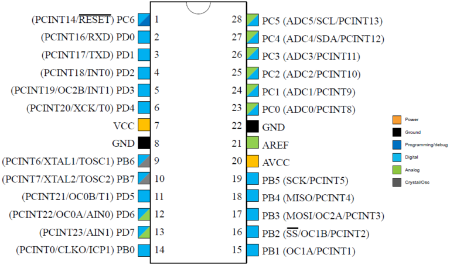

<h1> AVR-ASM-DHT22 :thermometer: </h1>

  <figure>
    
    <figcaption>This image is Copyright (C) 2021 Nicholas Warrener - All rights reserved.</figcaption>
  </figure>

This project uses three seven-segment displays to show humidity and temperature measurements from a DHT22. A push button is used to switch between readings. The decimal segment of the third display turns on when the temperature is below 0°C. An RGB LED is used to indicate to the user what quantity is being displayed. If the LED is green, the device is displaying the humidity and if the LED is red, the device is displaying the temperature. The device only shows measurements in Celsius! This project uses no libraries and is programmed entirely in AVR assembly.

<h2> Implementation Notes </h2>

In general, the device is interrupt driven so no delay loops are used! This makes for a much more elegant and efficient solution.

I find my implementation of the DHT communication protocol unique in the sense that it is almost completely interrupt driven. The algorithm only uses a timer to determine the duration of the pulses sent to it by the DHT22. It uses the timer to identify if the DHT22 is sending a one or a zero. By doing this, you don't have to fiddle with the timer values as the algorithm will read the data from the device when it is ready. No polling or delay loops are used! By doing this support for the DHT11 is enabled as you only need to change the initial delay value of the algorithm from 1ms to 18ms, and you also need to change the loop counter from 40 to 41 for the algorithm to work. You will need to make other changes to the code to get it to display the readings from the DHT11 properly.

The device still needs a software implementation of a debouncer for the push button. Currently no debouncer is used so you may need to press the push button a few times for the device to change the quantity being displayed.

I'm using an ATmega328P with its internal oscillator which is set to run at 8 MHz. By doing this, I have access to two more IO pins as no external crystal oscillator is connected to them. If you want to use this code on a 328P running at a different frequency, you'll need to recalculate the values for the timer output compare registers.

This device uses the watchdog timer (WDT) to make sure that the program does not get stuck waiting for a faulty or incorrectly connected DHT22. It is set to timeout every two seconds. If you make changes to the code and they cause the program execution to take longer than two seconds, you will need to increase the duration of the WDT. I recommend that you disable the WDT when making modifications and only once you know the modifications function correctly, then you should turn on the watchdog and see if it needs adjustment.

<h2> Making the device </h2>

I wouldn't say this is an advanced project, however it is not very beginner friendly. So, <b>please be careful when making the device. I'm not responsible if you damage and/or break your property and/or injure or kill living things. It is fairly easy to set the wrong fuse or incorrectly wire something!</b>

I've made an electrical schematic to show you how to assemble everything. There are probably mistakes in it so use your discretion. You can find the schematic <a href="https://github.com/UntidyRAM/AVR-ASM-DHT22/blob/main/docs/AVR-ASM-DHT22.pdf" target="_blank">here</a>.

I programmed the 328P using a <a href="https://www.fischl.de/usbasp/" target="_blank">USBasp</a> ISP programmer. I don't have a bootloader on the AVR as the internal oscillator is inaccurate and will probably cause issues with serial communication. I'm assuming you're using a 328P that has not been used before. It should be set to use the internal oscilator. If it has been modified, you will need to restore the fuses to their factory configuration. You can do this and flash code using a USBasp and AVRDUDESS.

<b>IF YOU DO NOT HAVE A SNAP THEN DO NOT SET THE DWEN FUSE, YOU WILL BE UNABLE TO COMMUNICATE WITH THE 328P. USE OF AN ON-CHIP DEBUGGER IS OPTIONAL.</b> I caved in and bought myself an <a href="https://www.microchip.com/developmenttools/ProductDetails/PartNO/PG164100" target="_blank">MPLAB Snap</a> which enabled me to perform on chip debugging. This made debugging much less painful. To connect the Snap to the device, connect pin 2 of the Snap to VCC, pin 3 to GND and pin 6 to the reset pin on the 328P (PC6). If you want to use the Snap in Atmel Studio (now Microchip Studio), you need to enable the DWEN fuse on the 328P. Enabling this fuse will disable ISP programming and enable debugWire. To re-enable ISP programming, you need to open Atmel Studio, run a debug session, and then click the Debug menu at the top and click "Disable debugWire and close." Please see <a href="https://microchipdeveloper.com/boards:debugbrick" target="_blank">here</a> for more information.

<h2> How to use this device </h2>

<b>Please do not use this device in applications where should the device malfunction and/or fail, injury or loss of life (of any kind) and/or property can occur!</b>

 When the device powers up, you will see "---" displayed on the segments. This informs the user that the device is on and that it is gathering its first measurement. If you see "---" after the device has been powered up for more than 15 seconds, then there is a fault with the DHT22.

If you connect PC5 to ground, the indicator RGB LED and the display will turn off. This indicates that the device is in flash mode. Flash mode sets the pins used by the ISP programmer to inputs with high impedance. Doing this enables the ISP device to communicate with the AVR.

<h2> Useful things </h2>

<ul>
  <li>I found this image <a href="https://microcontrollerslab.com/atmega328p-microcontroller-pinout-prograamming-features-datasheet/" target="_blank">here</a>. It's nice to use when assembling the device and just as a reference to quickly find a pin on the 328P.

</li>
  <li><a href="https://eleccelerator.com/avr-timer-calculator/" target="_blank">This</a> website is a really nice tool to quickly calculate the value that needs to go in the output compare register (of a timer) to get a specific time.</li>
  <li><a href="https://github.com/abcminiuser/avr-tutorials/blob/master/Timers/Output/Timers.pdf" target="_blank">This</a> PDF from Dean Camera is a really nice read if you'd like to understand how to setup timers. He does it in C but it is very easy to port to AVR ASM.</li>
  <li>You can find the instruction set for the 328P <a href="http://ww1.microchip.com/downloads/en/devicedoc/atmel-0856-avr-instruction-set-manual.pdf" target="_blank">here</a>. This is a nice reference when programming.</li>
  <li>The datasheet for the 328P can be found <a href="https://ww1.microchip.com/downloads/en/DeviceDoc/Atmel-7810-Automotive-Microcontrollers-ATmega328P_Datasheet.pdf" target="_blank">here</a>. The index is at the bottom of the PDF for some reason...</li>
</ul>
